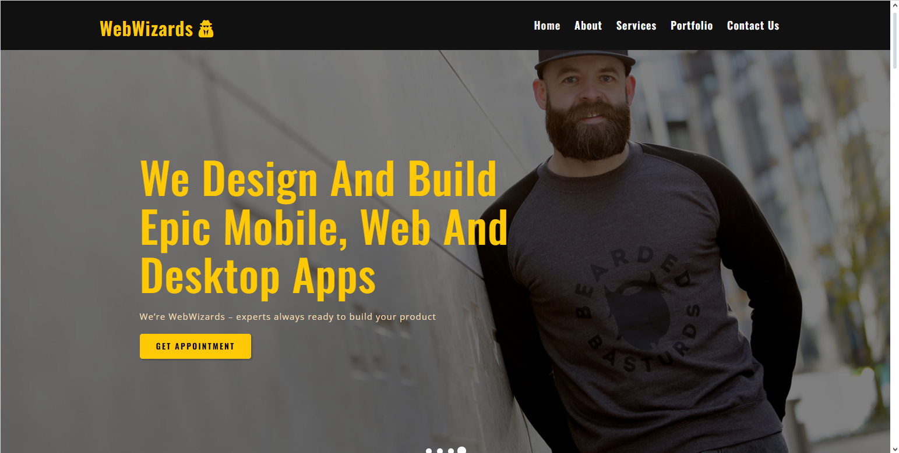

# Web Development Agency Website

This repository contains the source code for a web development agency's multi-page website, built using React and React Router.

## Features

- Modern functional React components.
- Dynamic routing with React Router v6.
- Responsive design for various device sizes.
- Contact form with validation and submission handling.
- Interactive gallery with lightbox feature.
- Pricing section with service listings.

## Structure

The website consists of the following main components:

Home: The landing page of the website.
About: Information about the agency.
Services: The services offered by the agency.
Gallery: A portfolio gallery showcasing past work.
Contact: A contact form for inquiries and quotes.
Footer: Contains contact information and additional links.
Each page is accessible via navigation managed by React Router's <Link> components for smooth SPA transitions.

## Installation

To get started with this project, clone the repository and install the dependencies:

git clone <https://github.com/yosephdev/web-wizards-site>

cd your-repository-folder

npm install

## Usage

After installing the dependencies, you can start the development server by running:

npm start

This will launch the website on localhost:3000 where you can view and interact with the application.

## Deployment

For production builds, use:

npm run build

This will generate a build directory with your compiled project. You can deploy this to your preferred hosting service.

## Contributing

We welcome contributions to this project! Please feel free to submit a pull request or create an issue for bugs and feature requests.

## Contact

For questions and support, please contact us at <contact@yoseph.dev>.
